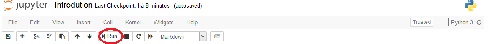
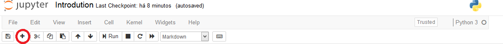
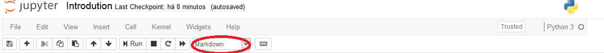
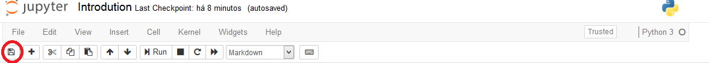
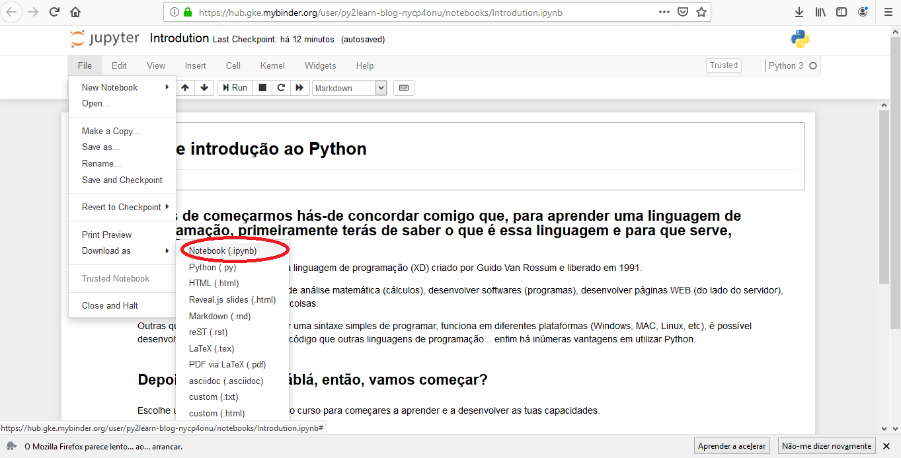

[Português](https://py2learn.github.io/Py2Learn/)

# Before you start this course, we are going to teach you how to use a notebook. 

## To run a cell, you only need to select the cell and then click on **Run**.

## To create a new cell use the button "+".

## Each cell is associated to a type (Markdown - text; Code; Raw NBConvert - code that won't be ran), to create a cell you need to choose the type on the dropdown list.

## To save all the changes, click on the save button.

## If you want to download the notebook, select "File", choose "Download as" and finally select "Notebook"

## Click on the icon above and start learning!!!

